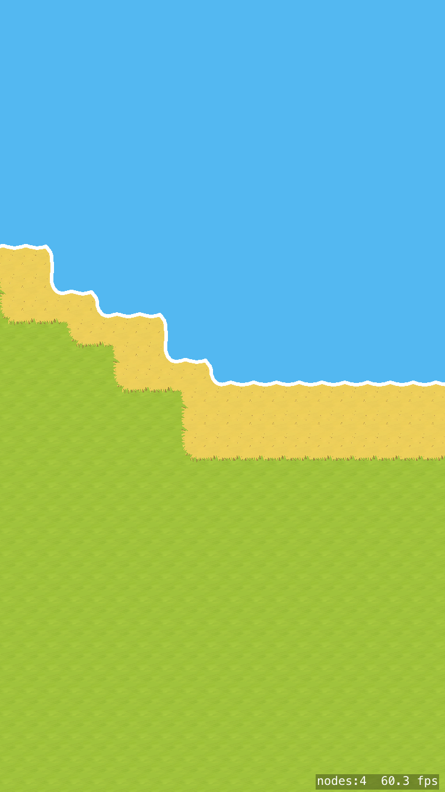
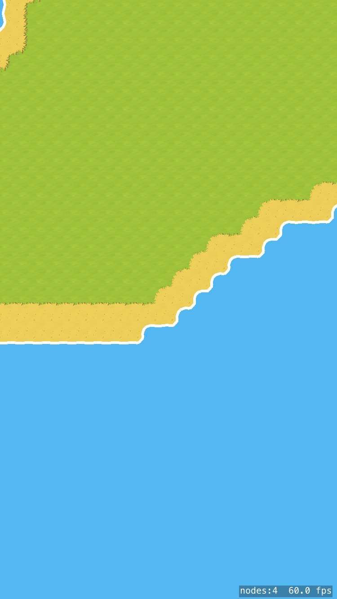
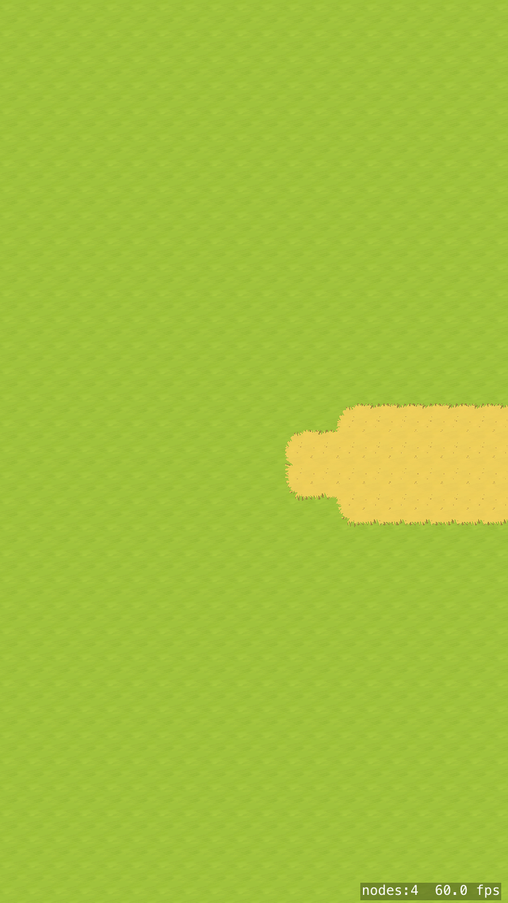
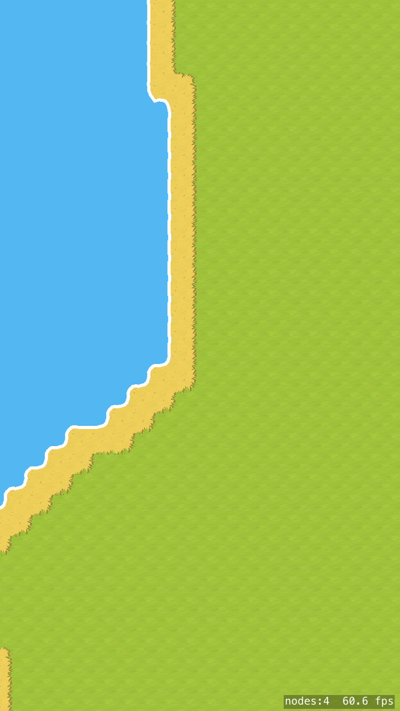
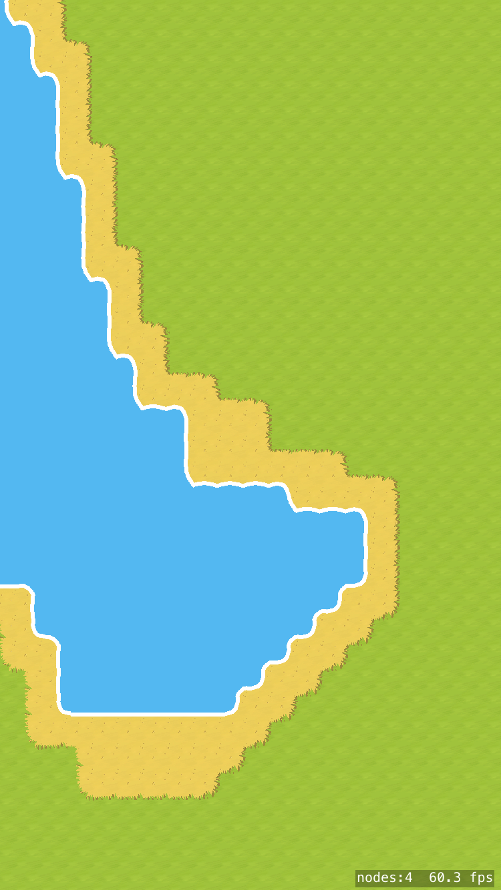

# RandomTerrainGenerator
A random terrain generator using GameplayKit noise classes.
Done with following the tutorial from https://www.hackingwithswift.com/example-code/games/how-to-create-a-random-terrain-tile-map-using-sktilemapnode-and-gkperlinnoisesource

Tap on the screen to generate new terrain.
 

